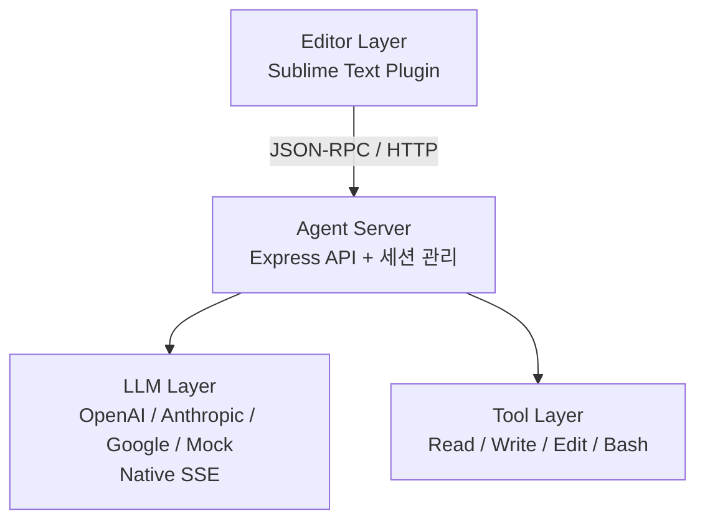
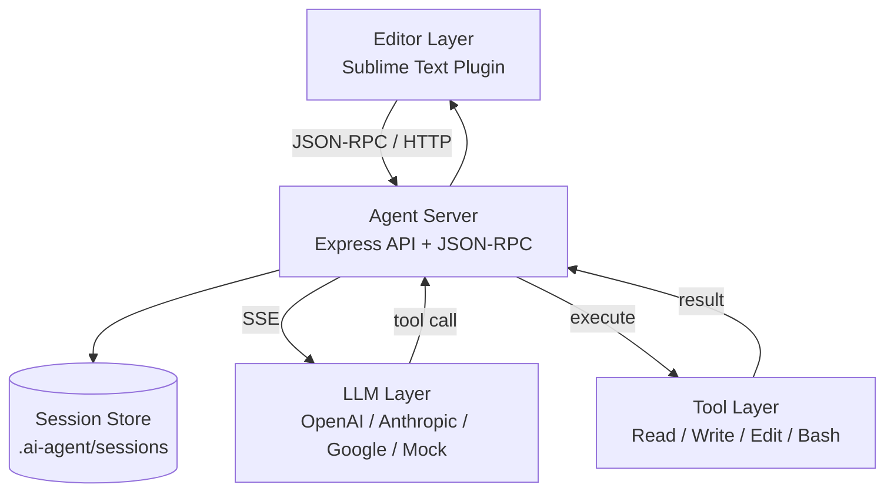

# 나의 맥미니에 오픈클로 설치 및 삭제

**언어:** [English](README-EN.md) | [한국어](README.md) | [日本語](README-JP.md)

Maclaw(OpenClaw on my Mac Mini)는 경량 코어와 최소한의 시스템 프롬프트를 기반으로 에이전트의 자기 학습과 발전을 지향하는 Pi 기반 AI 에이전트입니다. 

Pi 기반의 OpenClaw에 영감을 받아 시작됐지만, 보안, 비용, 거버넌스 측면에서 사용자가 좀 더 높은 수준의 통제권을 유지하기 위한 실험적 프로젝트입니다.

현재는 로컬환경 (Mac Mini + Sublime Text)에서 실행되는 MVP v1.3 단계이며, Mock/실제 LLM(OpenAI/Anthropic/Google) 선택, JSON-RPC 스트리밍(native SSE), Mac 터미널과의 상호작용 기능을 제공합니다.

## 프로젝트 구조도 (아키텍처)

```
┌──────────────────────────────────────────────┐
│                Editor Layer                  │
│  - Sublime Text Plugin (MVP)                 │
└───────────────────┬──────────────────────────┘
                    │ JSON-RPC / HTTP
┌───────────────────▼──────────────────────────┐
│                Agent Server                  │
│  - Express API                               │
│  - 세션 관리 (.ai-agent/sessions)            │
└───────────────────┬──────────────────────────┘
                    │
┌───────────────────▼──────────────────────────┐
│                LLM Layer                     │
│  - OpenAI / Anthropic / Google / Mock        │
│  - Native SSE 스트리밍                       │
└───────────────────┬──────────────────────────┘
                    │
┌───────────────────▼──────────────────────────┐
│               Tool Layer                     │
│  - Read / Write / Edit / Bash                │
│  - 프로젝트 루트 경로 제한                    │
└──────────────────────────────────────────────┘
```

### Mermaid 다이어그램



### Mermaid 다이어그램 (확장)



## 주요 작업 정리

### 1) 에이전트 서버(MVP)
- Express 기반 로컬 서버 구축
- 기본 엔드포인트: `/health`, `/api/agent/process`, `/api/agent/sessions`, `/api/agent/sessions/:id`
- JSON-RPC 2.0 엔드포인트: `/rpc`
- 터미널 실행 승인 API: `/api/agent/terminal/request`, `/api/agent/terminal/execute`

### 2) 세션 관리
- 디스크 기반 세션 저장: `.ai-agent/sessions/`
- 세션 생성/조회/목록 기능
- 메시지 히스토리 기록

### 3) LLM 연동(OpenAI/Anthropic/Google)
- 모델 설정 로드: `~/.ai-agent/config.json`
- OpenAI/Anthropic/Google REST 호출 구현
- Mock LLM 지원
- 에러 상세 분기(권한/쿼터/모델 미지원 등)

### 4) 스트리밍(JSON-RPC + Native SSE)
- `/rpc`에서 JSON-RPC 스트리밍 지원
- 실제 LLM SSE 스트림을 읽어 델타 전송
- 툴 호출(function/tool call) 스트림 이벤트 전송

### 5) 기본 도구 레이어
- 파일 Read/Write/Edit
- Bash 명령 실행
- 작업 경로 제한(프로젝트 루트)

### 6) Sublime Text 플러그인(MVP)
- 커맨드: 대화/선택 편집/파일 리뷰
- 스트리밍 결과 Output Panel 출력
- 인라인 diff 팝업 + 수락/거부 UI
- 대화 기록/전체 목록 보기 및 컬러 구분 팝업
- 터미널 명령 승인 팝업 실행
- 현재 열려 있는 문서 전체 컨텍스트 포함
- 요청/응답 영역 분리 출력

## 배포 전략 / 로드맵

### 배포 전략
- **로컬 우선**: 사용자가 선택한 로컬 환경에서 실행
- **클라우드 확장**: 필요 시 외부 LLM 또는 원격 실행 환경 연결
- **에디터 중심**: Sublime 플러그인으로 실제 워크플로우 검증
- **최소 의존성**: 작은 런타임과 단순한 배포 구조 유지

### 로드맵(요약)
1. **MVP 안정화**: 스트리밍/세션/툴 호출 처리 안정화
2. **에디터 UX 고도화**: 인라인 diff, 부분 수락, 상태 표시
3. **툴 실행 루프**: tool call → 실행 → 결과 반영
4. **배포 확장**: 로컬/클라우드 통합 실행 가이드 정리

## 배포 가이드 (로컬 / 클라우드)

### 로컬 실행
1. 의존성 설치: `npm install`
2. 로컬 서버 실행: `npm run dev`
3. 설정 파일 생성: `~/.ai-agent/config.json`
4. 에디터 연동: `sublime/README.md` 참고

### 클라우드 실행(예시)
1. 서버 환경 준비: Node.js 20+ 설치
2. 프로젝트 배포: 소스 업로드 또는 컨테이너 이미지 생성
3. 환경 변수/설정 제공:
   - `~/.ai-agent/config.json` 또는 환경 변수 기반 구성(추후 확장)
4. 포트 공개 및 접근 제어:
   - `PORT` 지정
   - 방화벽/ACL로 접근 제한
5. 클라이언트 연결:
   - Sublime 플러그인의 서버 주소를 클라우드 주소로 변경

### Docker/Compose 배포
1. 로컬 설정 파일 준비: `./config/config.json`
2. 세션 저장용 디렉토리: `./data/`
3. 빌드/실행:
```bash
docker compose up -d --build
```
4. 접속 확인: `http://localhost:3000/health`

### Nginx 프록시 (스트리밍 포함)
`nginx/nginx.conf`에 스트리밍에 필요한 설정이 포함되어 있습니다.
- `proxy_buffering off`
- `proxy_read_timeout 3600s`

Compose 사용 시 Nginx 컨테이너가 `maclaw`로 프록시합니다.

### 운영 팁
- LLM 키는 서버에만 저장하고, 클라이언트에는 노출하지 않습니다.
- 스트리밍 연결은 장시간 유지될 수 있으므로 프록시 타임아웃을 확인합니다.
- 로그에는 API 키나 민감한 프롬프트를 남기지 않습니다.

## 빠른 시작

```bash
npm install
npm run dev
```

## API

### POST `/api/agent/process`
```json
{
  "prompt": "이 함수를 최적화해줘",
  "context": {
    "file": "/path/to/file.py",
    "selection": "def slow_function()...",
    "range": [10, 25]
  },
  "model": {
    "provider": "openai",
    "model": "gpt-4o-mini"
  }
}
```

#### curl 예시
```bash
curl -s http://localhost:3000/api/agent/process \
  -H "Content-Type: application/json" \
  -d '{
    "prompt": "이 함수를 최적화해줘",
    "context": {
      "file": "/path/to/file.py",
      "selection": "def slow_function()...",
      "range": [10, 25]
    },
    "model": { "provider": "openai", "model": "gpt-4o-mini" }
  }'
```

### POST `/rpc` (JSON-RPC)
```json
{
  "jsonrpc": "2.0",
  "method": "agent.process",
  "params": {
    "prompt": "선택 영역을 개선해줘",
    "context": {
      "file": "/path/to/file.py",
      "selection": "def slow_function()...",
      "range": [10, 25]
    },
    "stream": true
  },
  "id": 1
}
```

#### curl 예시 (스트리밍)
```bash
curl -N http://localhost:3000/rpc \
  -H "Content-Type: application/json" \
  -d '{
    "jsonrpc": "2.0",
    "method": "agent.process",
    "params": {
      "prompt": "선택 영역을 개선해줘",
      "context": {
        "file": "/path/to/file.py",
        "selection": "def slow_function()...",
        "range": [10, 25]
      },
      "stream": true
    },
    "id": 1
  }'
```

#### JSON-RPC 스트리밍 응답 예시
```json
{"jsonrpc":"2.0","result":{"type":"start","sessionId":"8f7e..."},"id":1}
{"jsonrpc":"2.0","result":{"type":"delta","content":"안녕하세요. "},"id":1}
{"jsonrpc":"2.0","result":{"type":"tool","name":"read","arguments":"{\"path\":\"/path/to/file.py\"}"},"id":1}
{"jsonrpc":"2.0","result":{"type":"delta","content":"코드를 확인했습니다."},"id":1}
{"jsonrpc":"2.0","result":{"type":"final","result":{"type":"message","content":"최종 응답입니다."}},"id":1}
```

### GET `/api/agent/sessions`
세션 목록 조회

### GET `/api/agent/sessions/:id`
세션 상세 조회

## 설정 파일
`~/.ai-agent/config.json`에 기본 모델을 지정할 수 있습니다.
```json
{
  "defaultModel": {
    "provider": "mock",
    "model": "mock-1"
  },
  "providers": {
    "openai": { "apiKey": "YOUR_KEY" },
    "anthropic": { "apiKey": "YOUR_KEY" },
    "google": { "apiKey": "YOUR_KEY" }
  }
}
```

## Sublime Text 플러그인
`sublime/README.md` 참고

### 단축키 목록 (macOS)
- `Cmd+Shift+A`: 에이전트 대화 요청
- `Cmd+Shift+E`: 선택 영역 개선
- `Cmd+Shift+R`: 전체 파일 리뷰
- `Cmd+Shift+H`: 최근 세션 대화 기록 보기
- `Cmd+Shift+L`: 전체 대화 목록 텍스트 출력
- `Cmd+Shift+C`: 전체 대화 목록 색상 팝업

### 터미널 승인 팝업 (자동 감지)
아래 형식으로 응답이 오면 터미널 실행 승인 팝업이 자동으로 뜹니다.

```text
terminal: ls -la
```

````text
```bash
ls -la
```
````

- 여러 명령 블록이 있으면 순차적으로 승인됩니다.
- 승인 팝업에서 `항상 허용/항상 거부` 정책을 선택할 수 있습니다.
- 팝업은 X를 누르기 전까지 유지됩니다.
- 실행 결과는 현재 세션 히스토리에 자동 저장됩니다.

#### 터미널 연계 흐름
1. 에이전트 응답에서 `terminal:` 또는 ```bash``` 블록 감지
2. 승인 팝업 표시
3. 승인 시 서버에서 명령 실행
4. 결과를 Output Panel 출력 + 세션 히스토리에 저장

## 부록: Mac(Mac Mini)에서 Clawdbot 완전 제거

이 섹션은 **Maclaw 애플리케이션 코드와는 별도**로, 같은 Mac에서 [Clawdbot](https://clawdbot.sh/) 게이트웨이·CLI를 쓰지 않을 때 **기기에서 제거하기 위한 참고 절차**입니다. 상세하고 최신 정보는 공식 문서 [Uninstall (Clawdbot)](https://clawdbot.sh/en/docs/install/uninstall/)을 우선 참고하는 것이 좋습니다.

### 권장 순서(CLI가 아직 실행 가능할 때)

1. **게이트웨이·서비스**  
   - `clawdbot gateway stop`  
   - `clawdbot gateway uninstall`  

2. **내장 제거(비대화형)**  
   - `clawdbot uninstall --all --yes --non-interactive`  
   - CLI 바이너리가 없을 때는 `npx -y clawdbot uninstall --all --yes --non-interactive`

3. **Node 전역 패키지**(설치 방식에 맞게 선택)  
   - `npm uninstall -g clawdbot` — 필요 시 `pnpm remove -g clawdbot` 또는 `bun remove -g clawdbot`

4. **macOS 앱을 설치한 경우**  
   - `/Applications/Clawdbot.app` 삭제(공식 `uninstall` 단계에서 함께 처리되는 경우가 많음)

5. **상태·데이터 디렉터리**(남아 있으면 수동)  
   - 환경 변수 `CLAWDBOT_STATE_DIR`가 없으면 기본값은 **`~/.clawdbot`** 입니다(`rm -rf "${CLAWDBOT_STATE_DIR:-$HOME/.clawdbot}"`).  
   - 에이전트 워크스페이스까지 지울 때: **`~/clawd`**  
   - 이후 이름이 OpenClaw 등으로 바뀐 설치에서는 **`~/.openclaw`** 등도 확인할 수 있습니다.

### CLI가 이미 없을 때(수동 정리 예시)

- **launchd**(레이블은 환경마다 다를 수 있음): 예)  
  `launchctl bootout gui/$UID/com.clawdbot.gateway` 후  
  `~/Library/LaunchAgents/com.clawdbot.gateway.plist` 삭제  
- Apple Silicon에서는 Homebrew 접두 **`/opt/homebrew`** 일 수 있습니다. **`which clawdbot`** 로 실제 경로 확인 후 해당 바이너리·설치 방식까지 정리합니다.  
- 사용자 범위가 아닌 **시스템 LaunchDaemon**을 썼다면 `/Library/LaunchDaemons/` 등도 점검합니다.

### 보안·계정

로컬에서 파일만 지워도 연동했던 서비스의 **세션, API 키, OAuth 토큰**이 자동으로 무효화되지 않을 수 있습니다. 각 제공자 설정에서 로그아웃·토큰 폐기·키 회전을 검토합니다.

### 2026년 Mac Mini에서 실제로 수행한 작업 요약

| 단계 | 내용 |
|------|------|
| 공식 CLI | `clawdbot gateway stop` → `clawdbot gateway uninstall` → `clawdbot uninstall --all --yes --non-interactive` 실행 |
| 제거 결과 | `~/.clawdbot`, `~/clawd`, `/Applications/Clawdbot.app` 삭제 및 게이트웨이 LaunchAgent 중지(이후 plist·휴지통까지 정리) |
| 전역 CLI | Apple Silicon 환경에서 `npm uninstall -g clawdbot` 로 글로벌 패키지 제거(예: 관련 실행 파일 경로 `/opt/homebrew/bin`) |

> 참고: Homebrew 레지스트리에 **깨진 cask**(예: 과거 이름과 맞지 않는 경로 참조 등)만 남아 `brew list` 가 실패한다면 Clawdbot 제거 결과와 무관하게 별도로 `brew doctor` 등으로 정리할 수 있습니다.

## 이번 작업 요약 (기획/빌드/수정)
- **기획**: Maclaw 목적/범위 정의, 로컬·클라우드 실행 중심의 미니멀 에이전트 방향 확정
- **빌드**: Express 서버 + LLM 레이어 + 세션 저장 + JSON-RPC 스트리밍 구성
- **통합**: OpenAI/Anthropic/Google 실제 호출 + native SSE 스트리밍
- **에디터**: Sublime 플러그인 MVP, 스트리밍 표시, 인라인 diff/수락
- **히스토리**: 세션별/전체 대화 기록 출력 + 시간표시 + 컬러 구분
- **안전 실행**: 터미널 명령 승인 플로우(요청→승인→실행)
- **배포**: Docker/Compose + Nginx 스트리밍 프록시 예시 추가
